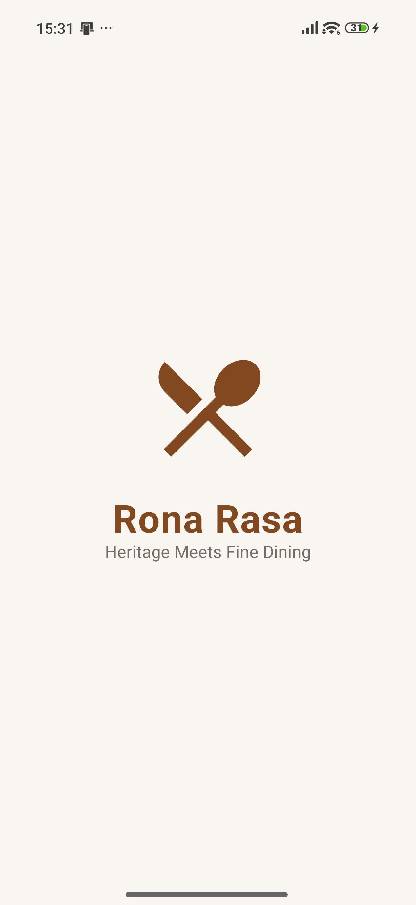
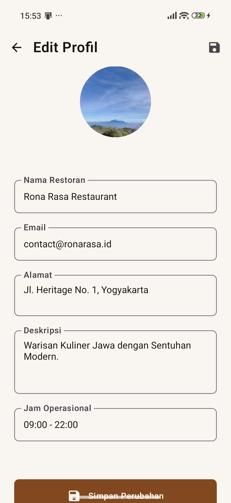
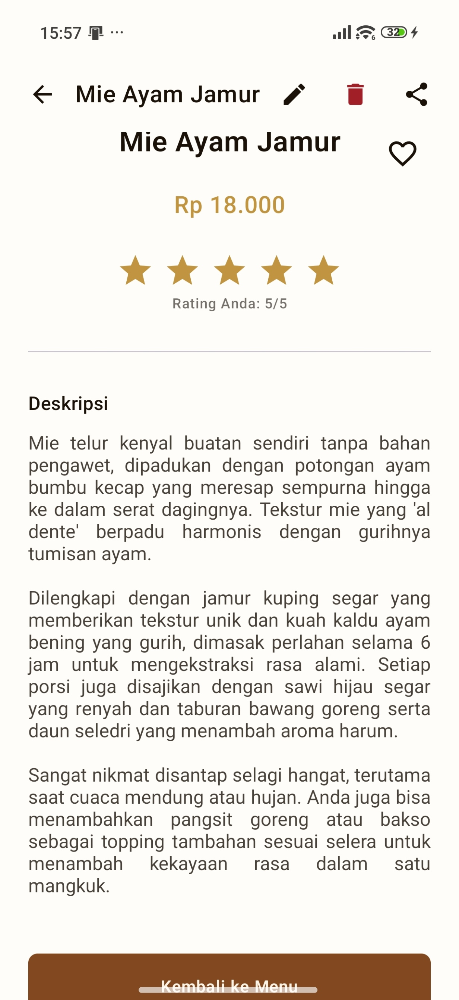
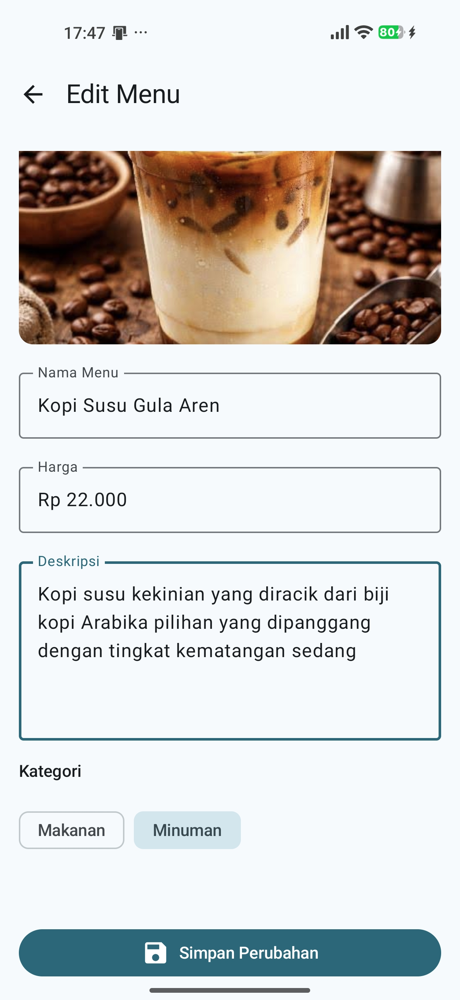

# 🍽️ Rona Rasa Restaurant - Profil Menu (Aplikasi UTS)

Aplikasi **Rona Rasa Restaurant** adalah aplikasi Android berbasis **Jetpack Compose** yang dikembangkan sebagai proyek Ujian Tengah Semester (UTS) untuk mata kuliah Pemrograman Mobile. Aplikasi ini dirancang untuk memberikan pengalaman manajemen menu restoran yang modern, estetik, dan fungsional dengan sistem penyimpanan lokal yang andal.

---

## 👤 Identitas Mahasiswa

- **Nama**: Willy Rafael F. Silalahi
- **NIM**: 23083000168
- **Kelas**: 6A2
- **Mata Kuliah**: Pemrograman Mobile
- **Semester**: 6
- **Program Studi**: Sistem Informasi
- **Instansi**: Universitas Merdeka Malang

---

## 🚀 Fitur Utama

Aplikasi ini mencakup berbagai fitur canggih untuk meningkatkan pengalaman pengguna:

### 🔹 Fungsionalitas CRUD & Data
- **Manajemen Menu**: Tambah menu baru, edit informasi menu yang ada, dan hapus menu secara *real-time*.
- **Penyimpanan Persisten**: Menggunakan *SharedPreferences* dan *Gson* untuk memastikan data menu, rating, dan profil tetap tersimpan meskipun aplikasi ditutup.
- **Manajemen Profil Restoran**: Pengguna dapat memperbarui informasi toko seperti Nama, Email, Alamat, Jam Operasional, serta mengganti foto banner dan foto profil utama.
- **Sistem Rating**: Memberikan penilaian (star rating) pada setiap menu yang tersimpan secara individu.
- **Fitur Favorit**: Menandai menu favorit dengan ikon hati yang tersimpan permanen.

### 🎨 UI/UX & Animasi Modern
- **Auto-Sliding Banner**: Banner informasi di Home Screen yang berganti secara otomatis dengan transisi *easing* yang halus.
- **Navigation Transitions**: Perpindahan antar layar menggunakan animasi *Horizontal Slide* yang konsisten di seluruh aplikasi.
- **Dark/Light Mode**: Dukungan penuh untuk mode gelap dan terang yang menyesuaikan sistem atau dapat diganti secara manual.
- **Parallax Header & Glassmorphism**: Efek visual dinamis pada layar detail menu dengan elemen UI semi-transparan.
- **Material 3 Design**: Menggunakan standar desain terbaru dari Google untuk tampilan yang bersih dan intuitif.

---

## 📂 Struktur Proyek

Berikut adalah struktur direktori utama dari aplikasi ini:

```text
app/src/main/java/com/example/menurestoran/
├── model/           # Data model (MenuItem) & Repository (GSON Storage)
├── navigation/      # Navigasi antar layar (NavHost & Transitions)
├── ui/              # Komponen User Interface
│   ├── screens/     # Implementasi Layar (Home, Menu, Detail, Profile, Edit)
│   ├── theme/       # Konfigurasi Tema (Color, Type, Theme, Shape)
│   └── utils/       # Animasi & Efek Visual (Shimmer, Press Effect)
└── utils/           # Utility (ImageHelper, CurrencyFormatter)
```

---

## 📸 Dokumentasi Aplikasi (Screenshots)

Berikut adalah visual dari fungsionalitas aplikasi:

| Layar Utama | Layar Detail & Menu | Layar Profil & Edit |
| :--- | :--- | :--- |
| **Splash Screen** <br> Animasi pembuka logo restoran. <br>  | **Menu Screen** <br> Daftar kategori makanan & minuman. <br>  | **Profil Restoran** <br> Ringkasan informasi bisnis. <br>  |
| **Splash (Dark Mode)** <br> Tampilan splash saat mode malam. <br>  | **Detail Menu** <br> Informasi lengkap, harga, & deskripsi. <br>  | **Edit Profil** <br> Form ubah data & ganti foto/banner. <br>  |
| **Home Screen** <br> Beranda dengan banner otomatis. <br>  | **Detail (Fitur Rating)** <br> Fitur penilaian menu yang persisten. <br>  | **Edit Menu** <br> Form untuk memperbarui data menu. <br>  |
| **Home (Menu Populer)** <br> Daftar menu favorit di beranda. <br>  | **Tambah Menu** <br> Menambahkan item baru ke database. <br>  | |
| **Home (Dark Mode)** <br> Tampilan beranda mode gelap. <br>  | | |
| **Home Dark (Alt)** <br> Tampilan alternatif mode gelap. <br>  | | |

---

## 🛠️ Tech Stack & Dependensi

- **Kotlin**: Bahasa pemrograman utama.
- **Jetpack Compose**: Toolkit UI modern untuk membangun aplikasi asli.
- **Material 3**: Standar desain terbaru untuk komponen UI.
- **Navigation Compose**: Manajemen navigasi antar layar.
- **Coil**: Library pemuatan gambar yang cepat dan efisien.
- **GSON**: Serialisasi JSON untuk penyimpanan data lokal.
- **SharedPreferences**: Penyimpanan data ringan untuk profil dan menu.

---

## ⚙️ Cara Menjalankan Project

1. **Clone Repository**
   ```bash
   git clone https://github.com/willyrafaelfs/Pemrograman-Mobile-UTS-Aplikasi-Restoran.git
   ```
2. **Buka di Android Studio**
   - Pilih *Open an Existing Project*.
   - Arahkan ke folder hasil clone.
3. **Sync Gradle**
   - Pastikan koneksi internet aktif untuk mengunduh dependensi (Coil, Gson, dll).
4. **Run Aplikasi**
   - Jalankan pada Emulator atau Device fisik (Min SDK 24).

---

© 2026 - Willy Rafael F. Silalahi - UTS Pemrograman Mobile
