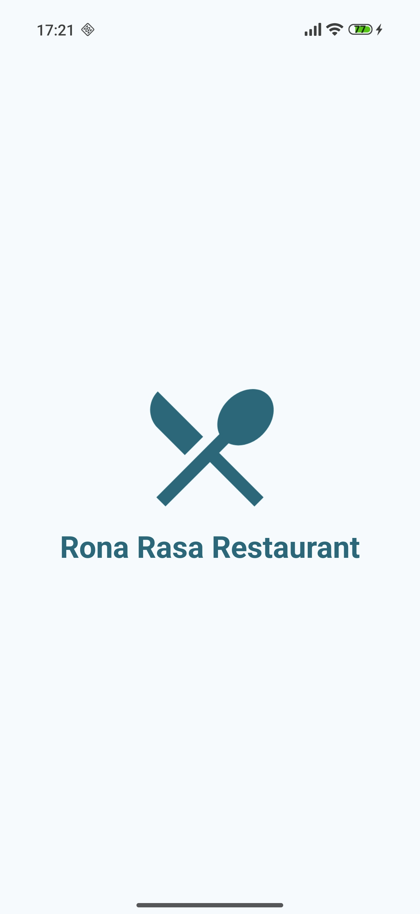
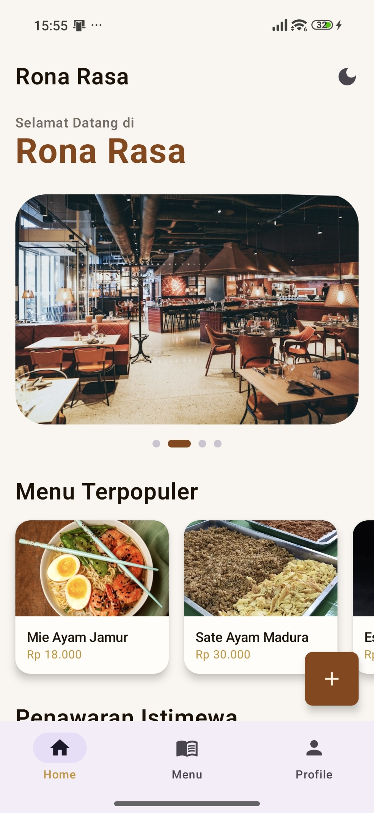
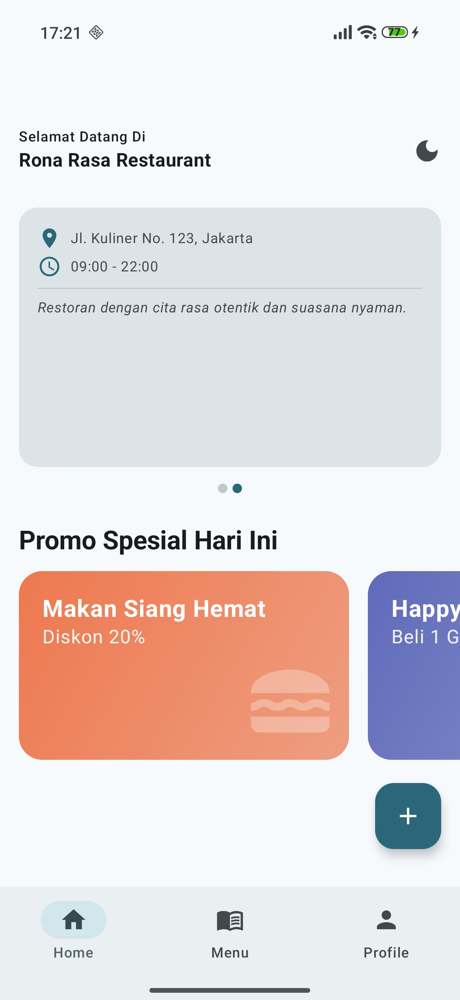
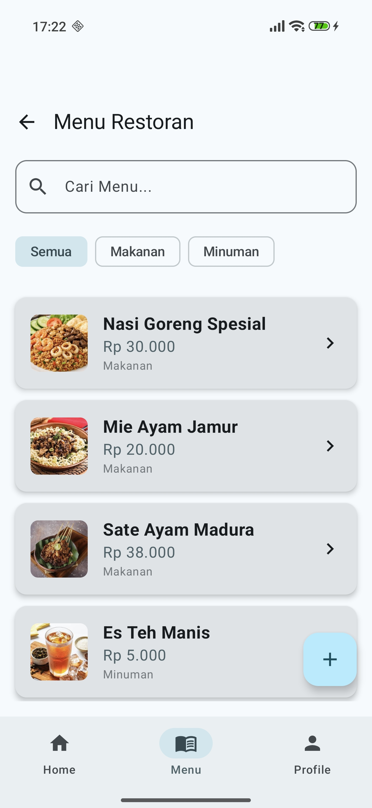
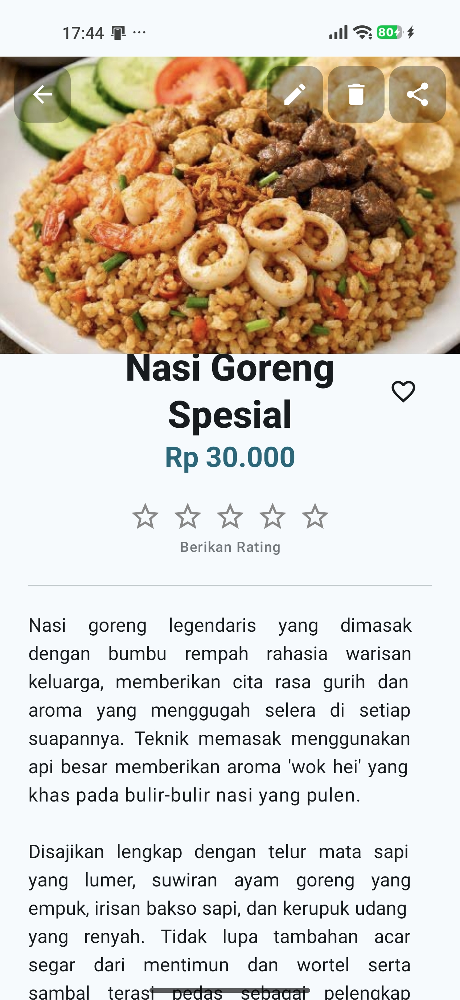
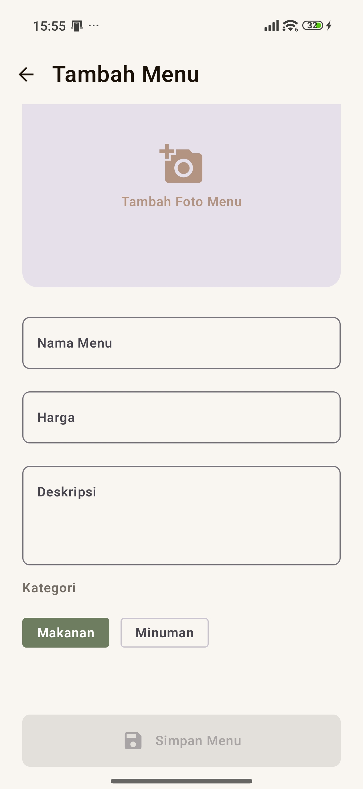
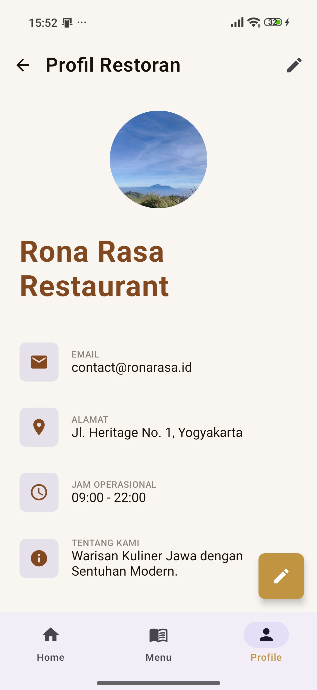
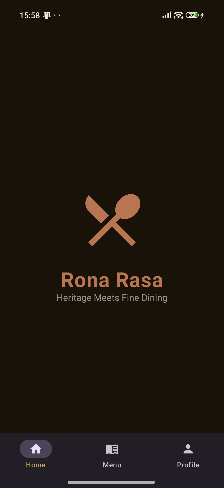
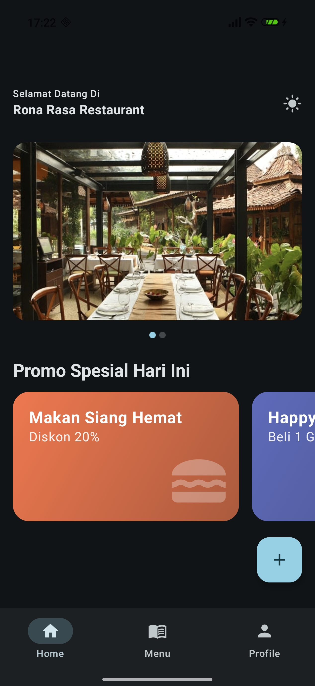
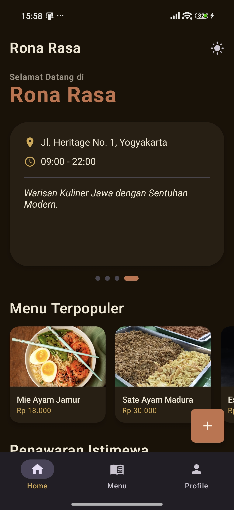

# 🍽️ Profil Menu Restoran (Aplikasi UTS)

Aplikasi **Profil Menu Restoran** adalah aplikasi Android berbasis **Jetpack Compose** yang dikembangkan untuk memenuhi tugas Ujian Tengah Semester (UTS) mata kuliah Pemrograman Mobile. Aplikasi ini dirancang untuk memberikan pengalaman pengguna yang modern dan responsif dalam mengelola daftar menu restoran secara lokal.

---

## 👤 Identitas Mahasiswa

- **Nama**: Willy Rafael F. Silalahi
- **NIM**: 23083000168
- **Program Studi**: Sistem Informasi
- **Semester**: 6
- **Mata Kuliah**: Pemrograman Mobile

---

## 🚀 Fitur Utama

Aplikasi ini dilengkapi dengan berbagai fitur fungsional dan peningkatan UI/UX:

### 🔹 Core Features
- **Single Activity Architecture**: Navigasi antar layar yang efisien menggunakan *Navigation Compose*.
- **Persistent Storage**: Penyimpanan data menu permanen menggunakan *SharedPreferences* yang dikombinasikan dengan *Gson* untuk serialisasi JSON.
- **Full CRUD Operations**: Kemampuan penuh untuk Menambah, Membaca, Mengubah (Edit), dan Menghapus menu restoran.
- **Local Image Upload**: Integrasi dengan *Android Photo Picker* untuk mengunggah gambar menu langsung dari galeri ponsel dan menyimpannya ke *Internal Storage*.

### 🎨 High-Fidelity UI/UX
- **Modern UI Components**: Menggunakan komponen Material 3 (Cards, Bottom Sheets, FAB, dll).
- **Dark/Light Mode Toggle**: Mendukung mode gelap dan terang yang bisa diganti secara *real-time*.
- **Smooth Animations**: Transisi antar layar menggunakan efek *Slide* dan *Fade* yang halus.
- **Animated Splash Screen**: Tampilan pembuka aplikasi dengan animasi logo.
- **Parallax Header**: Efek *collapsing toolbar* pada layar Detail Menu untuk visual yang lebih dinamis.
- **Interactive Pager**: Slider/Pager di Home Screen untuk menampilkan banner dan info restoran.
- **Auto-Format Rupiah**: Transformasi visual otomatis saat menginput harga (misal: mengetik "15000" otomatis tampil "Rp 15.000").
- **Real-time Search & Filter**: Pencarian menu berdasarkan nama dan filter kategori secara instan.
- **Implicit Intent**: Fitur integrasi eksternal seperti membuka lokasi di Google Maps dan membagikan detail menu ke aplikasi lain (WhatsApp, dll).

---

## 📸 Screenshot Aplikasi

### 1. Splash Screen & Home Screen
<p align="left">
  
  
  
</p>

### 2. Menu Screen & Pencarian
<p align="left">
  
</p>

### 3. Detail Menu (Parallax & Favorit)
<p align="left">
  
</p>

### 4. Form Tambah/Edit Menu
<p align="left">
  
</p>

### 5. Profile Screen & Edit Profile
<p align="left">
  
</p>

### 6. Tampilan Dark Mode
<p align="left">
  
  
  
</p>

---

## 🛠️ Tech Stack

- **Language**: [Kotlin](https://kotlinlang.org)
- **UI Framework**: [Jetpack Compose (Material 3)](https://android.com)
- **Navigation**: Navigation Compose
- **Image Loading**: [Coil](https://github.io)
- **Data Persistence**: SharedPreferences & [Gson](https://github.com)

---

## ⚙️ Cara Menjalankan Project

1. **Clone Repository**
   ```bash
   git clone https://github.com/willyrafaelfs/Restoran-Menu
   ```
2. **Buka di Android Studio**
   - Pilih *Open an Existing Project*.
   - Arahkan ke folder hasil clone.
3. **Sync Gradle**
   - Tunggu hingga proses *Gradle Sync* selesai. Pastikan koneksi internet stabil untuk mengunduh library (Coil & Gson).
4. **Run Aplikasi**
   - Pilih emulator atau perangkat fisik (min SDK 24).
   - Klik tombol **Run 'app'**.

---

© 2026 - Project UTS Pemrograman Mobile
